Kafka_ELK环境搭建说明文档
=================

>**虚拟机环境**

>主机系统：win10

>虚拟机：VMware Workstation

>虚拟机系统：Ubuntu16.04

>java版本：1.8

>python版本：python2.7


一、Kafka单机环境搭建
-------------
<br />

**1.zookeeper服务安装**
>注意：均在root权限中操作
<br />

（1）下载zookeeper 3.4.5，解压到/usr/local
解压命令  
```
tar -zxvf zookeeper-3.4.9.tar.gz
```
（2）编辑zoo.cfg
切换到conf目录下
```
cd zookeeper-3.4.9/conf/
```
复制zoo_sample.cfg到zoo.cfg
```
 cp zoo_sample.cfg zoo.cfg
```
然后编辑zoo.cfg如下（其它不用管，默认即可）：

```
initLimit=10
syncLimit=5
dataDir=/home/young/zookeeper/data（文件夹需要自己创建）
clientPort=2181
```
别忘了新建dataDir目录
```
mkdir /home/young/zookeeper/data
```
（3）为zookeeper创建环境变量
打开/etc/profile文件
```
vi /etc/profile
```
添加内容如下
```
export ZOOKEEPER_HOME=/home/young/zookeeper
export PATH=.:$ZOOKEEPER_HOME/bin:$JAVA_HOME/bin:$PATH
```
（4）配置完成之后，切换到zookeeper/bin目录下，启动服务
启动命令
```
 ./zkServer.sh start
```
启动成功图

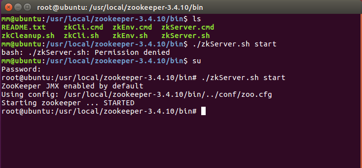

（5）暂时先关闭zookeeper服务，防止下面使用kafka启动时报端口占用错误。
```
 ./zkServer.sh stop
```
<br />

**2.kafka服务安装**

<br />

（1）下载kafka_2.10-0.10.0.0.tar.gz，解压到/usr/local
解压命令
```
tar -zxvf kafka_2.10-0.10.0.0.tar.gz
```
（2）修改配置

进入kafka/config目录下

1）.配置server.properties

```
#broker.id需改成正整数，单机为1就好
broker.id=1    
 
#指定端口号
port=9092    
 
#localhost这一项还有其他要修改，详细见下面说明
host.name=localhost     
 
#指定kafka的日志目录
log.dirs=/usr/local/kafka_2.10-0.10.0.0/kafka-logs（目录需要提前自己创建）   
 
#连接zookeeper配置项，这里指定的是单机，所以只需要配置localhost，若是实际生产环境，需要在这里添加其他ip地址和端口号
zookeeper.connect=localhost:2181
```

2）.配置zookeeper.properties

```
#数据目录
dataDir=/usr/local/kafka_2.11-0.11.0.0/zookeeper/data（需要提前手动创建）
 
#客户端端口
clientPort=2181
host.name=localhost
```

3）.配置producer.properties

```
zookeeper.connect=localhost:2181
```

4）.配置consumer.properties

```
zookeeper.connect=localhost:2181
```

<br />

**3.启动kafka服务**

<br />

（1）先启动zookeeper服务
```
bin/zookeeper-server-start.sh config/zookeeper.properties
```
（2）新开窗口启动kafka服务（前加nohup，让其在后台运行）
```
bin/kafka-server-start.sh config/server.properties
```
如图所示

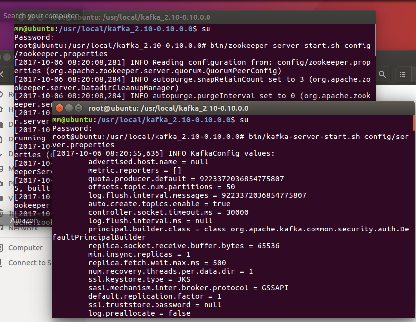

（3）新开窗口创建topic
```
bin/kafka-topics.sh --create --zookeeper localhost:2181 --replication-factor 1 --partitions 1 --topic testkafka
```
（4）新开窗口启动生产者
```
bin/kafka-console-producer.sh --broker-list localhost:9092 --topic testkafka
```
（5）新开窗口启动消费者
```
bin/kafka-console-consumer.sh --zookeeper localhost:2181 --topic testkafka --from-beginning
```

<br />

**4.传输消息测试**

<br />

如图

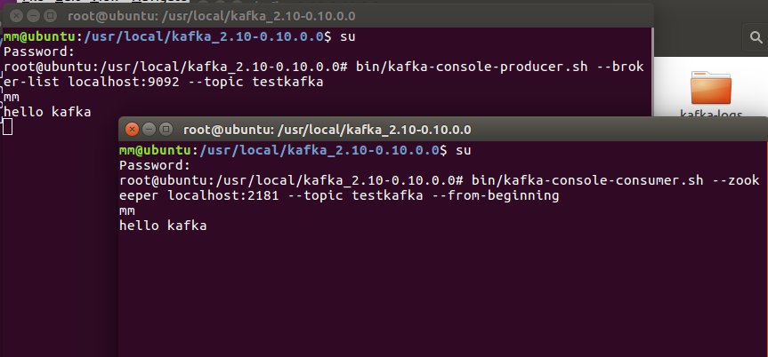

<br />

**5.用python脚本操作kafka**

<br />

>**生产者**
```
#!/usr/bin/python
# -*- coding:utf-8 -*-
 
from pykafka import KafkaClient
 
client = KafkaClient(hosts="127.0.0.1:9092")
topic = client.topics['testkafkamessage']
 

with topic.get_sync_producer() as producer:
    for i in range(4):
        producer.produce('test message'+ str(i))
```

>**消费者**
```
#!/usr/bin/python
# -*- coding:utf-8 -*-
 
from pykafka import KafkaClient
 
client = KafkaClient(hosts="127.0.0.1:9092")
topic = client.topics['testkafkamessage']
 
balanced_consumer = topic.get_balanced_consumer(
     consumer_group="test_kafka_group",
     auto_commit_enable=True,
     zookeeper_connect='127.0.0.1:2181'
     )
      
for message in balanced_consumer:
    if message is not None:
        print message.offset,message.value
```
先启动消费者程序，再启动生产者程序,运行结果如下图

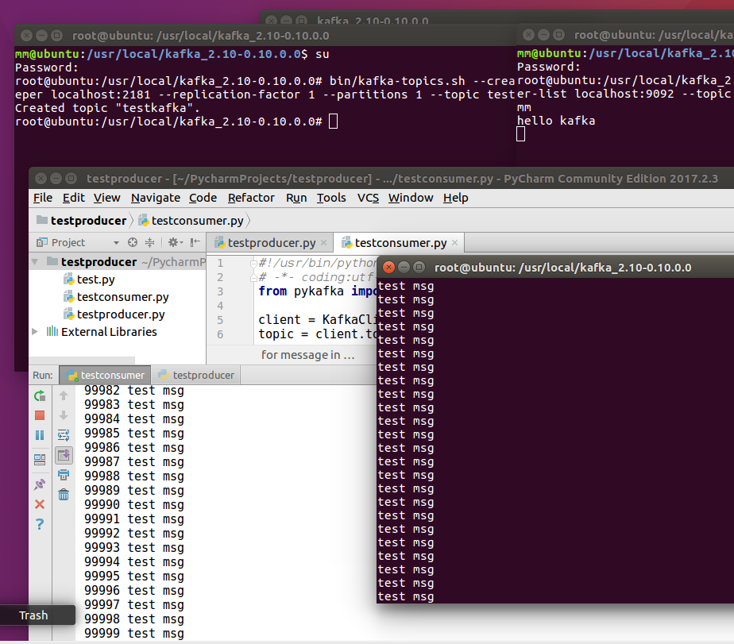

<br /> 


>**参考网址**

1.[安装Java环境]:

http://blog.csdn.net/dst1213/article/details/51232053

2.[Zookeeper和kafka服务搭建]:

http://www.cnblogs.com/vipzhou/p/7235625.html

http://www.cnblogs.com/tonglin0325/p/7039747.html

3.[传输消息]:

http://blog.csdn.net/jingshuigg/article/details/24439637

4.[python操作kafka]:

https://my.oschina.net/u/2263272/blog/788006


二、ELK单机环境搭建
-----------

<br />

**1.elasticsearch搭建**

<br />

（1）去官网下载elasticsearch压缩包，解压到/opt/elk目录
```
sudo tar -zxvf elasticsearch-2.4.0.tar.gz -C /opt/elk
```
（2）启动
```
/bin/elasticsearch
```
发现用root权限启动出现问题。
两种方式：
>1.创建新的用户来使用elasticsearch

>2.修改elasticsearch执行文件，使root用户可以启动elasticsearch   
 
具体操作：   
用vi打开elasicsearch执行文件，在变量ES_JAVA_OPTS使用前添加以下命令
```
ES_JAVA_OPTS="-Des.insecure.allow.root=true" 
```
再执行启动命令即可，如图

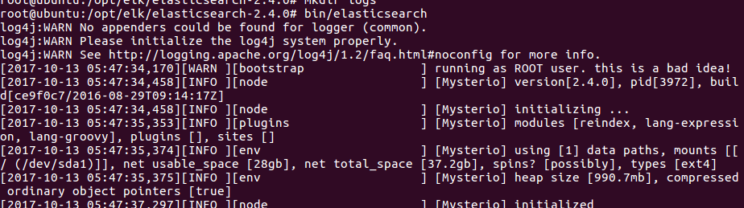

（3）查看浏览器
在浏览器窗口输入localhost:9200，可以看到类似于如下的界面

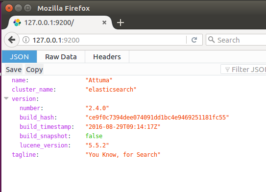

（4）安装head插件
执行命令
```
bin/plugin install mobz/elasticsearch-head
```
用浏览器访问网址 **http://localhost:9200/_plugin/head/**
如图

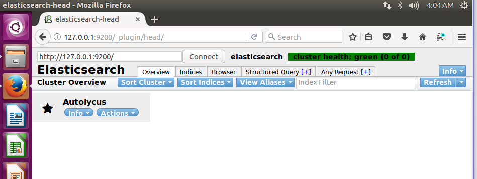

<br />

**2.logstash搭建**

<br />

（1）从官网下载安装包，解压到/opt/elk目录下
```
tar -zxvf logstash-2.4.0.tar.gz -C /opt/elk
```
（2）shell端输入 shell端展示

简单测试Logstash服务是否正常，预期将输入的内容结构化的输出到界面上
```
bin/logstash -e ‘input { stdin { } } output { stdout {} }’
```
结果如图

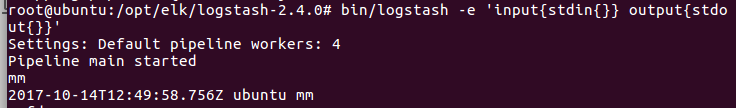

（3）shell端输入 web端展示

创建Logstash配置文件，并再次测试Logstash服务是否正常，预期可以将输入内容以结构化的日志形式打印在界面上

（这里配置了Logstash作为索引器，将日志数据传送到elasticsearch中）

1）.创建config文件夹
```
mkdir config
```
2）.在config文件夹下新建hello_search.conf文件
```
vim config/hello_search.conf
```
3）.编写hello_search.conf文件
```
input { stdin { } }
output {
  elasticsearch { hosts => ["localhost:9200"] }
  stdout { codec => rubydebug }
}
```
4）.执行命令
```
bin/logstash -f config/hello_search.conf
```
看到如下输出

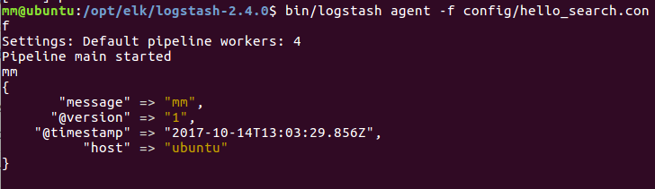

打开浏览器，一条记录显示

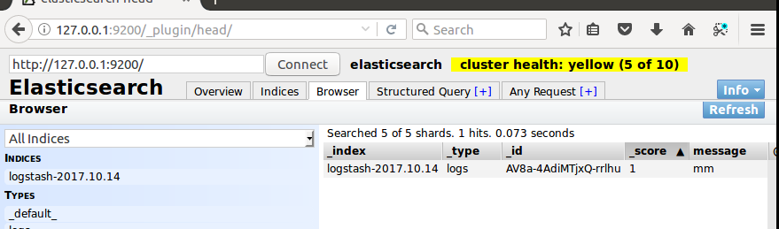

<br />

**3.kibana搭建**

<br />

（1）从官网下载压缩包，解压到指定目录/opt/

（2）启动kibana
```
bin/kibana
```
成功启动如图

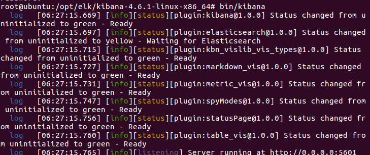

（3）web访问：http://localhost:5601/

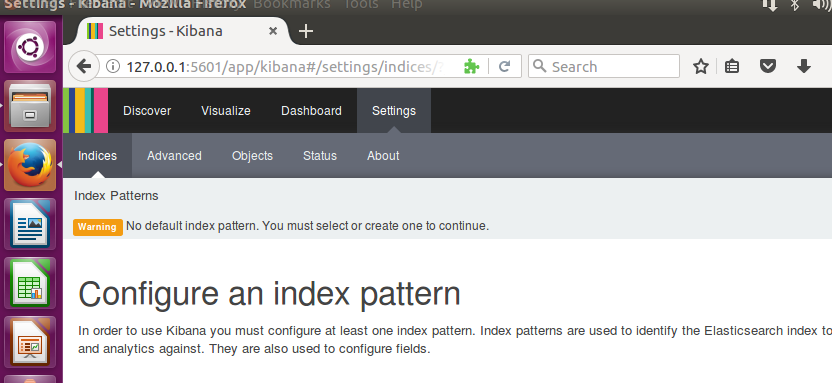

（4）配置索引

默认，Kibana的数据被指向Elasticsearch，使用默认的logstash-*的索引名称，并且是基于时间的，点击“Create”即可。

完成之后出现如下界面：

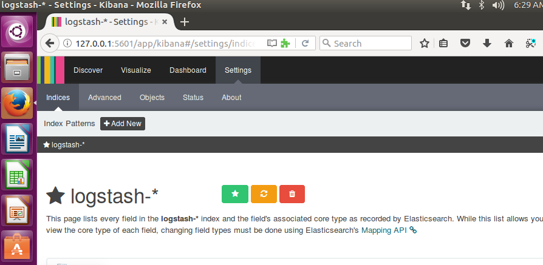

（5）测试kibana

用logstash输入几组测试数据

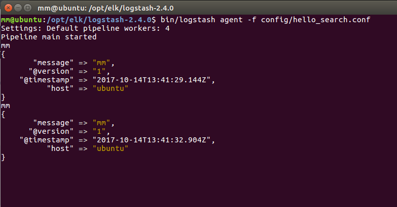

看到kibana页面显示刚刚发送的消息数据

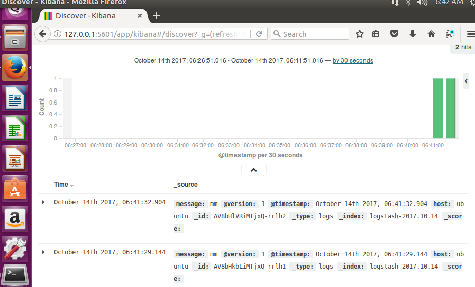

<br />

**4.将三者关联起来收集系统日志**

<br />

>将logstash配置为索引器，并将logstash的日志数据存储到elasticsearch。

（1）在config文件夹中新建test1.conf，并输入如下内容

```
input {
  file {
    type =>"syslog"
     path => ["/var/log/messages", "/var/log/syslog" ]
  }
  syslog {
    type =>"syslog"
    port =>"514"
  }
}
output {
  stdout { codec=> rubydebug }
  elasticsearch {hosts => "localhost" }
}
```
（2）启动logstash
```
bin/logstash agent -f config/test1.conf
```
(3)查看kibana的数据显示

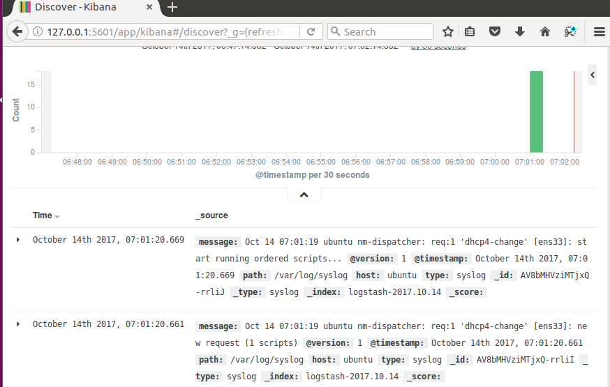

(4)查看elasticsearch的记录

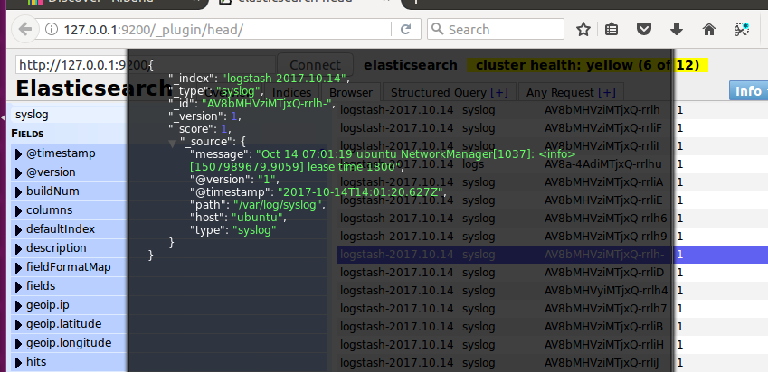

由上可见，日志数据都同步成功。

<br />

**5.python程序连接elasticsearch**

<br />

筛选全部index为logstash-2017.10.17的日志

```
#coding=utf-8
from elasticsearch import Elasticsearch
 
es=Elasticsearch([{'host':'127.0.0.1','port':9200}])
index = "logstash-2017.10.17"
query={"query":{"match_all":{}}}
resp=es.search(index,body=query)
resp_docs=resp["hits"]["hits"]
total=resp["hits"]["total"]
 
print total
print resp_docs[0]['_source']['@timestamp']
```          
<br /> 

>**参考网址**

1.[elk安装]:

http://www.linuxidc.com/Linux/2016-06/132618.htm

http://blog.csdn.net/gamer_gyt/article/details/52654263

2.[python操作elasticsearch语法]:

http://www.cnblogs.com/dplearning/p/5975158.html

<br /> 

三、kafka与logstash连接
------------------
<br />

**1.Kafka与logstash连接框架和原理**

<br />

数据流动按照logstash-->kafka-->zookeeper-->logstash-->elasticsearch-->kibana 顺序

关键是logstash的配置文件，因为整体数据流程出现两次logstash，

第一个是logstash收集系统的日志，作为生产者将日志数据给kafka，

第二个是logstash作为kafka的消费者，将输出的数据与elasticsearch以及kibana连接。

<br />

**2.连接过程**

<br />

（1）启动elasticsearch

（2）启动kibana

（3）修改logstash配置文件
1）.logstash生产数据给kafka
>test3.conf
```
input{
     file{
     path=>"/var/log/syslog"
     start_position=>"beginning"
}
}

output{
     kafka{
     bootstrap_servers=>"127.0.0.1:9092"
     topic_id=>"testkafkalog"
}
}
```

2）.logstash消费kafka数据并传递给elasticsearch
>test2.conf
```
input{
    kafka {
        zk_connect => "127.0.0.1:2181"
        group_id => "logstashtest"
        topic_id => "testkafkalog"
        codec=>plain
        reset_beginning => false
        consumer_threads => 5
        decorate_events => true
 
}
}

output {
        elasticsearch {
            hosts => ["127.0.0.1:9200"]
            index => "kafka_logstash-%{+YYYY.MM.dd}"
            manage_template => true
            flush_size => 50000
            idle_flush_time => 10
            workers => 2
}
}
```

（4）启动kafka
1）.先启动zookeeper服务
```
bin/zookeeper-server-start.sh config/zookeeper.properties
```
2）.新开窗口启动kafka服务（前加nohup，让其在后台运行）
```
bin/kafka-server-start.sh config/server.properties
```

如图

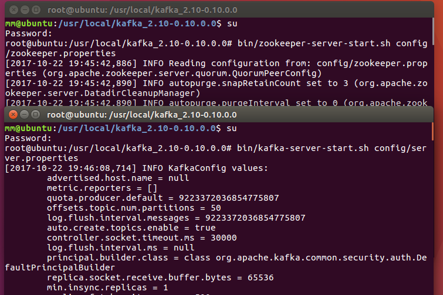

（5）启动logstash

分别开两个窗口,执行命令
>作为消费者
```
bin/logstash -f config/test2.conf
```
>作为生产者
```
bin/logstash -f config/test3.conf
```
（6）连接elasticsearch

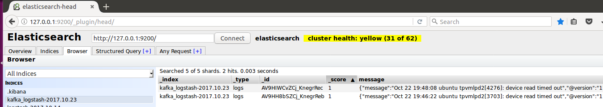

（7）连接kibana
修改settings，把索引前缀改成kafka_logstash-*

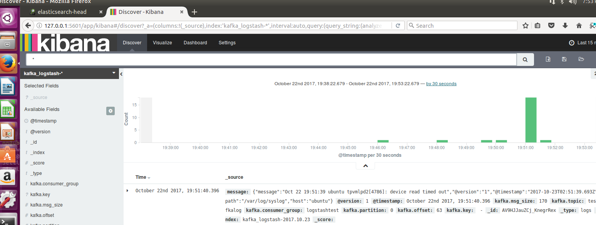

（8）用python脚本写消息到kafka里

>logstash配置
```
input{
    kafka {
        zk_connect => "127.0.0.1:2181"
        group_id => "logstashtest"
        topic_id => "testkafkamessage"
        codec=>plain
        reset_beginning => false
        consumer_threads => 5
        decorate_events => true
 
}
}

output {
        elasticsearch {
            hosts => ["127.0.0.1:9200"]
            index => "msg_kafka_logstash-%{+YYYY.MM.dd}"
            manage_template => true
            flush_size => 50000
            idle_flush_time => 10
            workers => 2
}
}
```
>python脚本
```
#!/usr/bin/python
# -*- coding:utf-8 -*-
 
from pykafka import KafkaClient
 
client = KafkaClient(hosts="127.0.0.1:9092")
# 查看所有的topic
#print client.topics
topic = client.topics['testkafkamessage']

 
with topic.get_sync_producer() as producer:
    for i in range(4):
        producer.produce('test message'+ str(i))
```

结果如图

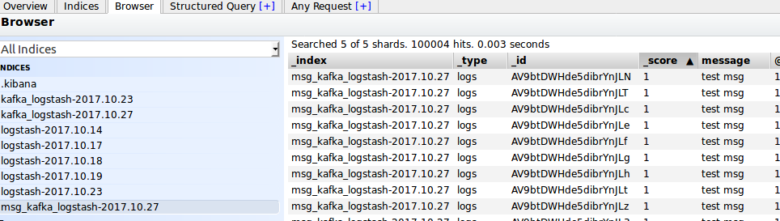

<br/>

>**参考网址**

1.[kafka连接logstash]:

http://tchuairen.blog.51cto.com/3848118/1855090

http://www.cnblogs.com/shiyiwen/p/6150213.html

http://blog.csdn.net/gaowenhui2008/article/details/70231146 


四、部署kafka-zookeeper集群及收集日志信息
----------------------------

>**环境**    
Elk 192.168.244.136    
Kafka1 192.168.244.138    
Kafka2 192.168.244.139    
确保三台虚拟机均装好kafka和zookeeper（参考之前kafka搭建文档）

<br />

**1.修改三台虚拟机中的zoo.cfg文件**

<br />

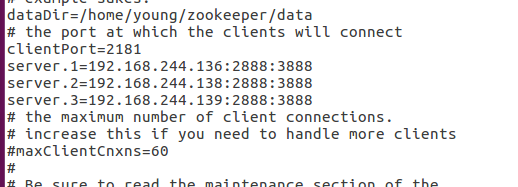


>server.1 这个1是服务器的标识也可以是其他的数字， 表示这个是第几号服务器，用来标识服务器，这个标识要写到快照目录下面myid文件里
192.168.244.136为集群里的IP地址，第一个端口是master和slave之间的通信端口，默认是2888，第二个端口是leader选举的端口，集群刚启动的时候选举或者leader挂掉之后进行新的选举的端口默认是3888

<br />

**2.创建myid文件**

<br />

```
#server1(elk虚拟机中)
echo "1" > /usr/local/zookeeper/zkdata/myid
 
#server2(kafka虚拟机中)
echo "2" > /usr/local/zookeeper/zkdata/myid
 
#server3(kafka2虚拟机中)
echo "3" > /usr/local/zookeeper/zkdata/myid
```
注意要把myid文件放在dataDir的路径下

<br />

**3.改主机名**

<br />

在etc文件夹中编辑hostname文件，修改主机名

<br />

**4.主机和IP映射**

<br />

编辑etc文件夹下的hosts文件，把刚刚改过的三台主机名和其对应IP加到里面


<br />

**5.修改三台主机的brokerid**

<br />

手动修改meta.properties文件，默认情况下，应该在/tmp/kafka-logs目录下

<br />

**6.修改kafka的server.properties文件配置**

<br />

```
#broker.id=0  
每台服务器的broker.id都不能相同   
 
#hostname
host.name=192.168.244.136

#在log.retention.hours=168 下面新增下面三项
  
message.max.byte=5242880
default.replication.factor=2
replica.fetch.max.bytes=5242880
 
#设置zookeeper的连接端口
zookeeper.connect=192.168.244.136:2181,192.168.244.138:2181,192.168.244.139:2181
```

<br />

**7.启动三台服务**
>三台虚拟机均进行如下操作

<br />

（1）先启动zookeeper服务
```
 ./zkServer.sh start
```

（2）查看服务状态
```
./zkServer.sh statue
```
（3）启动kafka
```
bin/kafka-server-start.sh config/server.properties
```

<br />

**8.连接logstash**

>分别尝试了在安装了elk的虚拟机上运行python脚本,和只装了kafka的虚拟机上运行python脚本两种情况

<br />

（1）在elk虚拟机中的操作

1）.修改logstash的conf
>test5.conf
```
input{
    kafka{
       zk_connect => "192.168.244.136:2181,192.168.244.138:2181,192.168.244.139:2181"
       group_id => "jstest"
       topic_id => "jstest1"
       codec => plain
       reset_beginning => false
       consumer_threads => 5
       decorate_events => true
}
}

output{
       elasticsearch{
          hosts => ["127.0.0.1:9200"]
          index => "retest-%{+YYYY.MM.dd}"
          manage_template => true
          flush_size => 50000
          idle_flush_time => 10
          workers =>2
}
}
```

2）.编写生产者脚本
```
#!/usr/bin/python
# -*- coding:utf-8 -*-
import codecs
 
from pykafka import KafkaClient
 
client = KafkaClient(hosts="192.168.244.136:9092")
 
retopic=client.topics["jstest1"]
 
refilename="auth.json"
 
def produce_kafka_file(filename,topic):
    with topic.get_sync_producer() as producer:
        with codecs.open(filename,"r") as rf:
            for line in rf:
                line = line.strip()
                if not line:
                    continue
                producer.produce(line)

 
produce_kafka_file(refilename,retopic)
```
3）.结果：成功导入elasticsearch

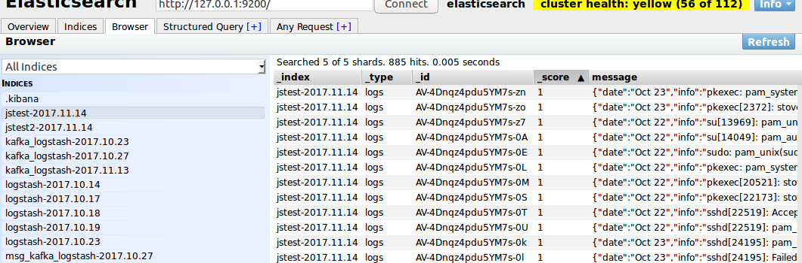

（2）在只有kafka的机器上运行python脚本

>对应的logstash的conf文件
```
input{
    kafka{
       zk_connect => "192.168.244.136:2181,192.168.244.138:2181,192.168.244.139:2181"
       group_id => "jstest"
       topic_id => "jstest2"
       codec => plain
       reset_beginning => false
       consumer_threads => 5
       decorate_events => true
}
}

output{
       elasticsearch{
          hosts => ["127.0.0.1:9200"]
          index => "retest-%{+YYYY.MM.dd}"
          manage_template => true
          flush_size => 50000
          idle_flush_time => 10
          workers =>2
}
}
```

>生产者脚本

```
#!/usr/bin/python
# -*- coding:utf-8 -*-
import codecs
 
from pykafka import KafkaClient
 
client = KafkaClient(hosts="192.168.244.138:9092")
 
retopic=client.topics["jstest2"]
 
refilename="setup.json"
 
def produce_kafka_file(filename,topic):
    with topic.get_sync_producer() as producer:
        with codecs.open(filename,"r") as rf:
            for line in rf:
                line = line.strip()
                if not line:
                    continue
                producer.produce(line)

 
produce_kafka_file(refilename,retopic)
```

结果：同样运行成功，成功导入elasticsearch

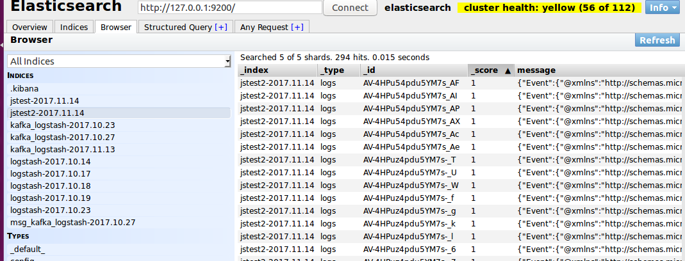

<br/>

>**参考网址**

1.[kafka_elk系统搭建]:

https://www.cnblogs.com/luotianshuai/p/5206662.html  

<br />


